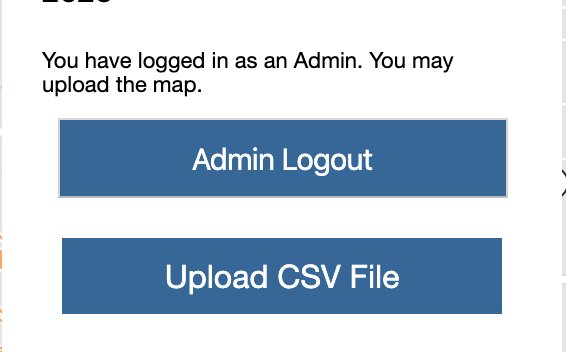

# Grove Park Foundation Investment/Future Asset Mapping Tool

Digital Map User Guide

By: Mapcom

## Side Notes:
- Partner with Grove Park Foundation
- Aiming to build a digital map tool to display the assets in the Grove Park area
- This project uses mapbox to display a map of the area
- CVS file cannot be accessed unless an Admin is logged in
- There is a link to Grove Park Website in the Community Development Project Data in colored text in the top left
The initial admin credentials: 
  - Email: test@gmail.com
  - Password: testtest
- Please contact Catherin(catherine0925@gatech.edu), Jingbo(wjbjimmy@gmail.com), or Nancy (rwang391@gatech.edu) to add a Grove Park project owner, who will be able to manage admins in the future
 
Thank you for using our digital map! This is a basic user guide to help new users access all of the functionality our product has to offer.
 
Initially Accessing the Map:
Download the entire project file from GitHub:  https://github.com/CatherineZhuang/SLS3110DigitalMap
Navigate in the project file directory
Click on map.html in order to open up the map in your internet browser (Google Chrome is recommended)
The map should look like this: 

Add in New/Current Data: 
The data that is displayed on the map comes from a CSV file which is edited through an excel sheet. The CSV file is uploaded into a database which will upload the data onto the map, allowing the project information to be projected. 
 
Open the map
Click on a point in the map in order to get the longitude and latitude
Copy the longitude and latitude at the top of the web browser
In the project directory there is a mockdata.xlsx file that can be edited by adding or deleting projects 
- Add information to all categories such as project description, longitude, and latitude.
- Category should be one of: Trail, Park, Business, School, Reconstruction, Others. Please kindly be aware of the spelling for the current version.
Once the changes you make are to your liking, save the xlsx file as a CSV file 
- You can do this by changing the Save As file type

Open the Map from play.html 
Click the Upload CSV button right under the legend/scroll feature box
Upload the CSV file you just saved 
The data should be uploaded and the map will be updated.
 
 
Features of the Map:
Scroll bar: In the grey box on the top left, there is a scroll bar with the target year on the bottom. Only the project from 2015 to 2025 will be shown on this map. As you drag the scroll bar from left to right, you will see the year advance as well as the icons of certain projects being started that year pop up. 

 

Legend: Right above the scroll feature is a legend that shows the different colors that differentiate the types of projects that are being shown.

Icons: The project icons that pop are interactive. When you click on the icons, information and sometimes links will pop up, allowing the user to inform him or herself about the project that was selected. 

Login: The login allows the user to edit the CSV file. This login is confidential in order to prevent the map from being overrun with false project information and protect the legitimacy of actual projects. 

  before login:
  
  
  after login:
  

If you have any further questions, please feel free to contact any of our team members:
- Zhu Zhuang: catherine0925@gatech.edu
- Nancy Wang: rwang391@gatech.edu
- Jingbo Wang: jingbowang@gatech.edu
- Robin Luo: hluo76@gatech.edu
- Nick Huang: nickhuang29@gatech.edu
- Robert Freeman: metus81@gatech.edu

